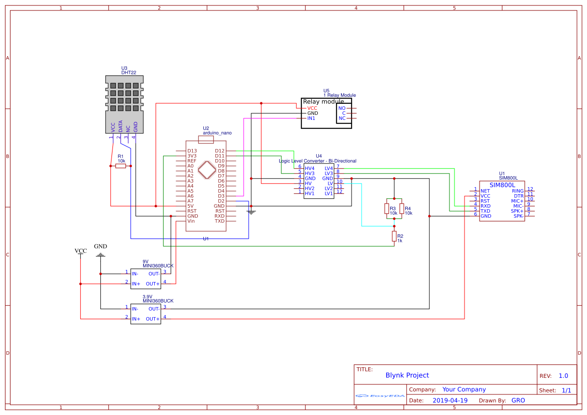
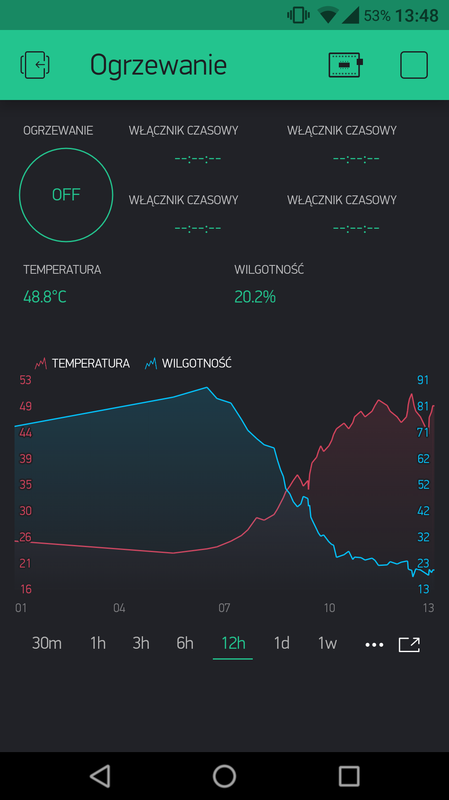

# BlynkProject
Projekt zakłada zdalne sterowanie przełącznikiem, odczyt temperatury i wilgotności przy wykorzystaniu platformy [Blynk](https://blynk.io/).

## Komponenty
* Arduino Nano
* Moduł GSM - SIM800L
* Czujnik temperatury i wilgotności - DHT22
* Moduł przekaźnika
* Konwerter poziomów logicznych
* 2x Przetwornica DC-DC - Step-down - Mini 360

## Schemat

## Aplikacja

